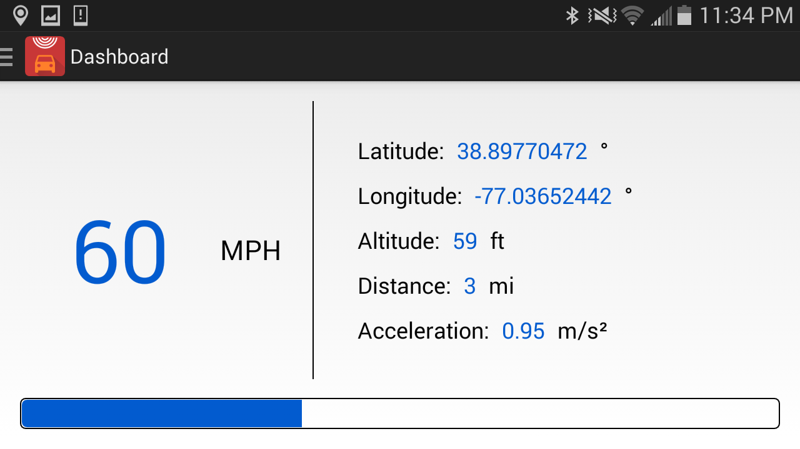
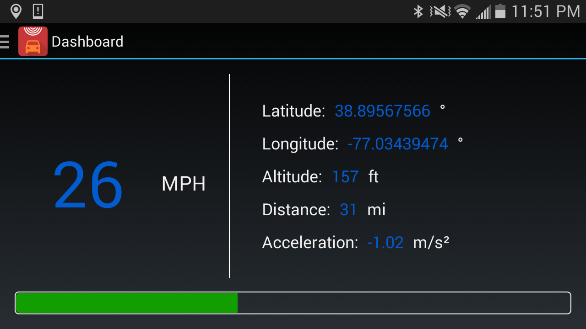

GPS Auto Dashboard
====================

<ul>
<li>GPS Auto Dashboard is an Android app that was created for the purpose of bringing a digital speedometer, along with additional statistics, to any automobile.</li>
<li>Using the Android device's built-in Global Positioning System (GPS), this app is able to calculate your speed, acceleration, distance traveled, and location coordinates.</li>
<li>This app features an automatic day-and-night theme switching algorithm. Which means as you are driving the app will automatically switch to either the light or dark theme, depending on the light conditions.</li>
<li>This app also features an acceleration bar widget to give you an indication of how fast, or slow, you are either accelerating or braking.</li>
</ul>

<h2>Running the App</h2>

Those who wish to run the app without building may follow these set of steps:

<ul>
<li>Download the APK in the repository: [GPSAutoDash.apk](gps-auto-dashboard.apk)</li>
<li>Transfer the APK file to your device (preferably the Downloads folder).</li>
<li>Install the APK on your device by clicking on it in the folder in which you transferred it to.</li>
</ul>

Those who wish to build the app:

<ul>
<li>Open Android Studio.</li>
<li>Import the project by using the Import Project function.</li>
<li>Android Studio will then automatically build the app.</li>
</ul>

<h2>Authors</h2>

<a title="Zach Rohde" href="http://zachrohde.com">Zach Rohde</a>
